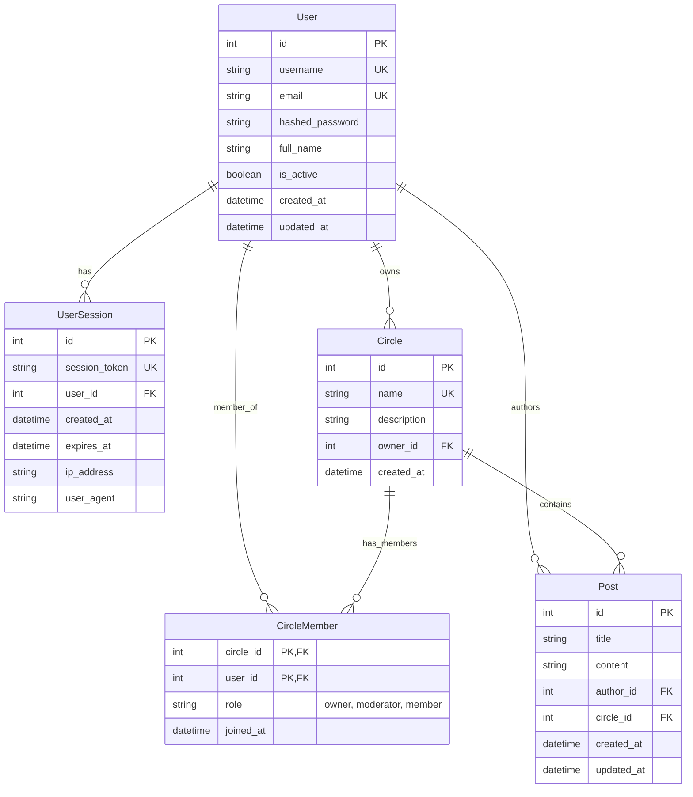

# Database Schema

## Entity Relationship Diagram (ERD)

This diagram represents the database schema using standard Crow's Foot notation.

### Mermaid Diagram

## Tables Description

### Users
| Column | Type | Constraints | Description |
|--------|------|-------------|-------------|
| id | int | PRIMARY KEY | Unique user identifier |
| username | string | UNIQUE, NOT NULL | User's login username |
| email | string | UNIQUE, NOT NULL | User's email address |
| hashed_password | string | NOT NULL | Argon2 hashed password |
| full_name | string | | User's full name (optional) |
| is_active | boolean | DEFAULT true | Account status |
| created_at | datetime | NOT NULL | Account creation timestamp |
| updated_at | datetime | | Last update timestamp |

### Circles
| Column | Type | Constraints | Description |
|--------|------|-------------|-------------|
| id | int | PRIMARY KEY | Unique circle identifier |
| name | string | UNIQUE, NOT NULL | Circle name |
| description | string | | Circle description |
| owner_id | int | FOREIGN KEY (users.id) | Circle owner |
| created_at | datetime | NOT NULL | Creation timestamp |

### Circle Members
| Column | Type | Constraints | Description |
|--------|------|-------------|-------------|
| circle_id | int | PRIMARY KEY, FOREIGN KEY | Circle identifier |
| user_id | int | PRIMARY KEY, FOREIGN KEY | User identifier |
| role | string | NOT NULL | Role in circle: 'owner', 'moderator', 'member' |
| joined_at | datetime | NOT NULL | Join timestamp |

### Posts
| Column | Type | Constraints | Description |
|--------|------|-------------|-------------|
| id | int | PRIMARY KEY | Unique post identifier |
| title | string | NOT NULL | Post title |
| content | text | NOT NULL | Post content |
| author_id | int | FOREIGN KEY (users.id) | Post author |
| circle_id | int | FOREIGN KEY (circles.id) | Circle (null = public post) |
| created_at | datetime | NOT NULL | Creation timestamp |
| updated_at | datetime | | Last update timestamp |

### User Sessions
| Column | Type | Constraints | Description |
|--------|------|-------------|-------------|
| id | int | PRIMARY KEY | Unique session identifier |
| session_token | string | UNIQUE, NOT NULL | Session token for auth |
| user_id | int | FOREIGN KEY (users.id) | Associated user |
| created_at | datetime | NOT NULL | Session creation time |
| expires_at | datetime | NOT NULL | Session expiration time |
| ip_address | string | | Client IP address |
| user_agent | string | | Client user agent |

## Circle Roles & Permissions

| Role | Badge | Permissions |
|------|-------|-------------|
| Owner | 👑 | Full control: delete circle, change settings, assign roles, remove members, all moderator actions |
| Moderator | 🛡️ | Moderate content: delete any post, remove members, approve join requests |
| Member | 👤 | Basic participation: view posts, create posts, comment, like |

## Key Relationships

- **User → Circles**: One-to-many (a user can own multiple circles)
- **User → Posts**: One-to-many (a user can author multiple posts)
- **User → CircleMember**: One-to-many (a user can be member of multiple circles)
- **Circle → CircleMember**: One-to-many (a circle can have many members)
- **Circle → Posts**: One-to-many (a circle can contain many posts)
- **User → UserSession**: One-to-many (a user can have multiple active sessions)