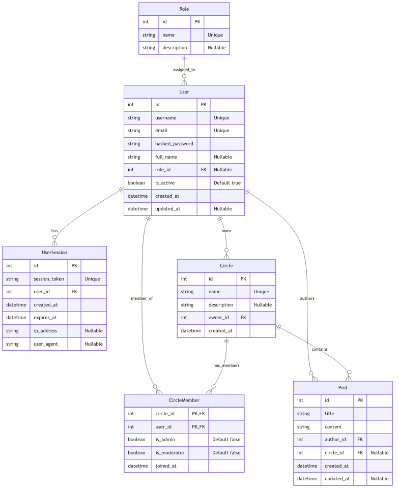
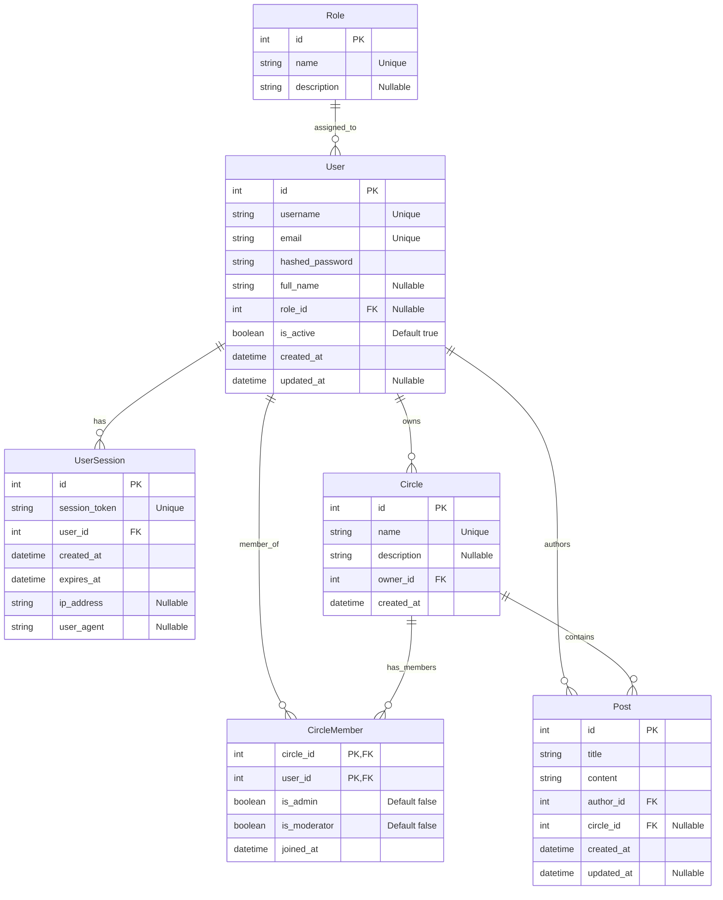

# Entity Relationship Diagram (ERD)

This diagram represents the database schema using standard Crow's Foot notation.

### Mermaid Source

```mermaid
erDiagram
    Role {
        int id PK
        string name "Unique"
        string description "Nullable"
    }

    User {
        int id PK
        string username "Unique"
        string email "Unique"
        string hashed_password
        string full_name "Nullable"
        int role_id FK "Nullable"
        boolean is_active "Default true"
        datetime created_at
        datetime updated_at "Nullable"
    }

    UserSession {
        int id PK
        string session_token "Unique"
        int user_id FK
        datetime created_at
        datetime expires_at
        string ip_address "Nullable"
        string user_agent "Nullable"
    }

    Circle {
        int id PK
        string name "Unique"
        string description "Nullable"
        int owner_id FK
        datetime created_at
    }

    CircleMember {
        int circle_id PK, FK
        int user_id PK, FK
        boolean is_admin "Default false"
        boolean is_moderator "Default false"
        datetime joined_at
    }

    Post {
        int id PK
        string title
        string content
        int author_id FK
        int circle_id FK "Nullable"
        datetime created_at
        datetime updated_at "Nullable"
    }

    %% Relationships
    Role ||--o{ User : "assigned_to"
    User ||--o{ UserSession : "has"
    User ||--o{ Circle : "owns"
    User ||--o{ Post : "authors"
    User ||--o{ CircleMember : "member_of"
    Circle ||--o{ CircleMember : "has_members"
    Circle ||--o{ Post : "contains"
```
