# Role Hierarchy

This document outlines the role-based access control (RBAC) structure for the application.

## Global Roles (System-Wide)
These roles are stored in the `roles` table and apply to the entire platform.

| Role | Description |
| :--- | :--- |
| **Super Admin** | Highest level of access. Manages system settings, all users, and all content. |
| **Admin** | Managing platform operations, moderation, and user support. |
| **User** | Standard role for all registered users. Can create Circles and posts. |

## Local Roles (Circle-Specific)
These roles apply only within a specific Circle (group).

| Role | Description |
| :--- | :--- |
| **Owner** | The creator of the Circle. Has full control over the Circle's settings and members. |
| **Moderator** | Appointed by the Owner. Can manage posts and members within the Circle. |
| **Member** | Standard participant in the Circle. |

## Hierarchy Diagram

```mermaid
graph TD
    subgraph "Global Roles (System-Wide)"
        SA[Super Admin] -->|Manages System| A[Admin]
        A -->|Manages Platform| U[User]
        U -->|Creates| C[Circle]
    end

    subgraph "Local Roles (Per-Circle)"
        Owner[👑 Owner] -->|Appoints| Mod[🛡️ Moderator]
        Mod -->|Moderates| Mem[👤 Member]
    end

    %% Relationships
    U -.->|Can be| Owner
    U -.->|Can be| Mod
    U -.->|Can be| Mem
```

